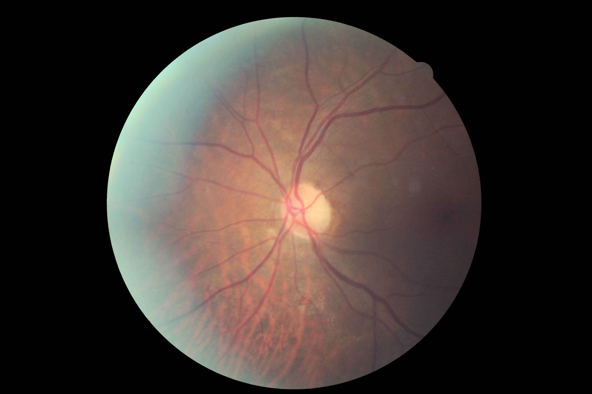

# W251_Project
## Katie Adams, Kevin Allen, Nate Black, and Malini Mittal  

This project explores different methods of large-scale image classification. The first method uses the Apache Spark framework while the second uses deep learning on GPUs with Python's Theano library.

##General Dataset Information
The following is a brief description of the dataset. Sample images and labels can be found in the `sample` directory.

We ran into some issues using ``wget`` to download the data - you need to be a registered user to download the data. Therefore, you must copy your local cookies into a text file and pass that to the ``wget`` call (or do some other workaround). Commands below.

```
[root@test ~]# mkdir data
[root@test ~]# cd data
[root@test data]# nano cookies.txt
[root@test data]# wget -x --load-cookies cookies.txt https://www.kaggle.com/c/diabetic-retinopathy-detection/download/train.zip.00{1..5}
```  

Download took an hour with ``network=1000`` on the VM.

```
FINISHED --2015-06-15 19:04:53--
Downloaded: 5 files, 33G in 1h 1m 28s (9.05 MB/s)
```
###How Big is Unzipped Training Data?  
The training files are pieces of a single archive so they were combined and then unzipped. Deleted the individual zip components to save space. Unzip took ~30 minutes.

```
[root@test download]# cat train.zip.00* > train.zip
[root@test download]# unzip train.zip
```

Sample image:
 
The ``sample`` directory has some more example image files.   

35,126 images - 33 GB zipped, 36GB unzipped
```
[root@test download]# ls
train  train.zip
[root@test download]# ls -1 train | wc -l
35126
[root@test download]# du -sh *
36G	train
33G	train.zip

```

The distribution of the training data is highly skewed.  

```
Cases     Level			Proportion

25810  0 - No DR             73%
 2443  1 - Mild               7%
 5292  2 - Moderate          15%
  873  3 - Severe             2%
  708  4 - Proliferative DR   2%
35126  Total
```  

##Single Machine Attempt
`single_machine_attempt` was an exploratory analysis and provided evidence that the problem was too large for a single machine. The `single_machine_attempt/README.md` outlines some of the key findings and shows sample output from the analysis.  

##Scala Logistic Regression  
`scala_logistic_regression` outlines the development of the logistic regression classifier used for Spark. The classifier was developed using the local file system and then augmented to run on HDFS after the code was functional. Note the code in this directory is not the final code used for either the pre-processor or the classifier but was left in the repo for informational purposes.  

##Spark
The Spark aspect of the project can be accessed by first going through the instructions in the `ansible` or `salt` directories to launch a cluster. After going through the `ansible/README.md` the user will have a running SoftLayer cluster with both Hadoop and Spark running. `sp1` will be the master node.

Relevant URLS  
- `https://<MASTER IP>:8080` Spark Cluster
- `https://<MASTER IP>:4040` Spark Job
- `https://<MASTER IP>:50070` HDFS


The logistic regression classification can be run as `hadoop` user in `/home/hadoop`.  

The user must build the project with SBT.

```
su - hadoop
cd
sbt assembly
```

After the project is built, use `spark-submit` to run the process.

```
$SPARK_HOME/bin/spark-submit --class "w251.project.logisticregression.LogisticRegression" --master spark://sp1:7077 --num-executors 8 --executor-memory 9g --executor-cores 7 /home/hadoop/target/scala-2.10/LogisticRegression-assembly-1.0.jar hdfs://sp1:9000/logisticregression/train_64.csv hdfs://sp1:9000/logisticregression/test_64.csv /home/hadoop/out_64.txt 
```

After the process runs, an output file will be in the `/home/hadoop/` directory. This file is in the needed format for a Kaggle submission.   
   
Some diagnostics regarding the prediction:

```
Precision = 0.7372774428711623
F1 = 0.7372774428711623
Recall = 0.7372774428711623

===Confusion Matrix ===
5254.0  1.0  16.0  0.0  3.0
477.0   0.0  3.0   0.0  1.0
1069.0  1.0  5.0   0.0  0.0
163.0   0.0  1.0   0.0  0.0
135.0   0.0  3.0   1.0  0.0
```

##Results  
A graphical display of the results can be found at <a href="http://nathanieljblack.github.io/W251_Project/">http://nathanieljblack.github.io/W251_Project/</a>

Test results from the Spark runs can be found in the `spark_data` directory.
